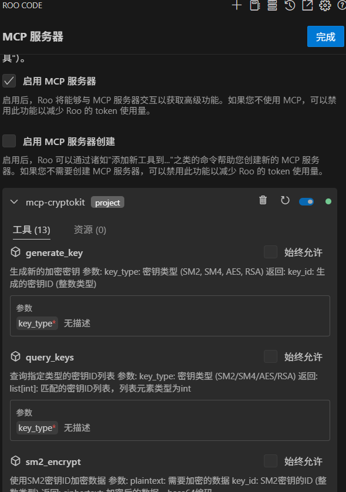
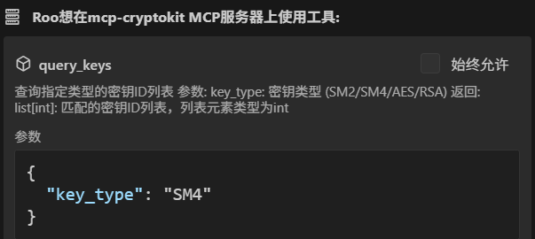
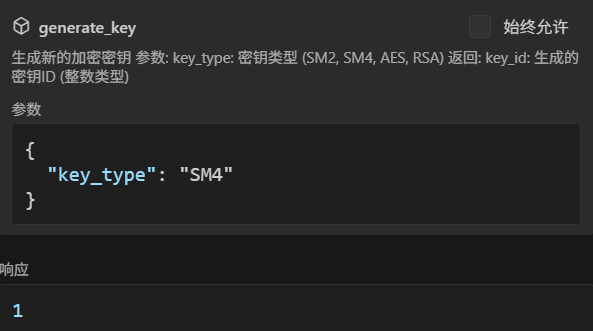
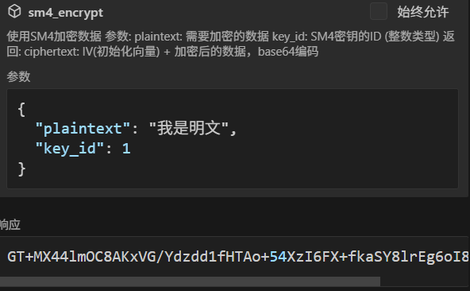

# MCP协议密码套件 (mcp-cryptokit)

[](https://github.com/sansec-ai/mcp-cryptokit)

## 简介

mcp-cryptokit 是一个基于MCP协议的密码套件，旨在为AI应用提供高效的密码学支持。它支持国密标准算法和通用密码算法，并提供密钥管理功能。

**mcp-cryptokit**：提供以下功能：
  - 对称加解密
  - 非对称加解密
  - 签名验签
  - Hash计算
  - 密钥管理

## 功能特点

- **标准MCP协议**：方便AI应用集成
- **支持国密标准算法**：包括SM2/SM3/SM4等
- **支持通用密码算法**：如AES、RSA、SHA等
- **支持密钥管理**：提供安全的密钥生成、存储和管理功能

## 安装与使用

### 安装

```bash
# 下载项目到本地目录, 如：/work/mcp-cryptokit
git clone https://github.com/sansec-ai/mcp-cryptokit.git  /work/mcp-cryptokit
cd mcp-cryptokit
uv venv
source .venv/bin/activate
# 安装依赖
uv pip install .
```
### 使用示例
可以在任何支持mcp协议的客户端使用本密码套件。
#### mcp 配置
以roo code编程为例，其配置步骤如下：
- 在vscode中安装roo code插件(>=v3.11)，并配置大模型提供商，可参考[Roo-Code](https://github.com/RooVetGit/Roo-Code/blob/main/locales/zh-CN/README.md):。
- 在roo code的MCP服务器配置文件中增加配置如下：

```json
{
  "mcpServers": {
    "mcp-cryptokit": {
      "command": "uv",
      "args": [
        "--directory",
        "/work/mcp-cryptokit",
        "run",
        "server.py"
      ],
      "timeout": 30,
      "alwaysAllow": [],
      "disabled": false,
      "env": {
        "CRYPTOKIT_KEY_STORE_PATH": "/data/keystore.json"
      }
    }
  }
}

```
配置成功，可在Roo Code的`MCP 服务器`查看到`mcp-cryptokit`服务。



#### 使用
在`Roo Code`中配置`mcp-cryptokit`服务成功，可在对话框输入以下请求：
```bash
使用sm4密钥加密数据：我是明文
```
`Roo Code`会自动调用`mcp-cryptokit`服务，创建sm4密钥，并使用sm4密钥加密明文。示例如下：
##### 1.第一步，尝试查询sm4类型密钥

##### 2.第二步，如果密钥不存在，则创建sm4密钥，并返回密钥ID。

##### 3.第三步，使用密钥ID和明文，调用sm4加密服务，并返回密文。


也可以直接使用指定密钥加密数据，请求如下：
```bash
使用1号sm4密钥加密数据：我是明文
```

## 贡献指南
欢迎贡献代码或提出改进建议！请参考贡献指南了解如何参与项目。
## 许可证
mcp-cryptokit 遵循 Apache License 2.0 协议，允许自由使用、修改和分发。
## 联系我们
如需进一步了解或技术支持，请访问 GitHub项目页面 或联系项目维护者。